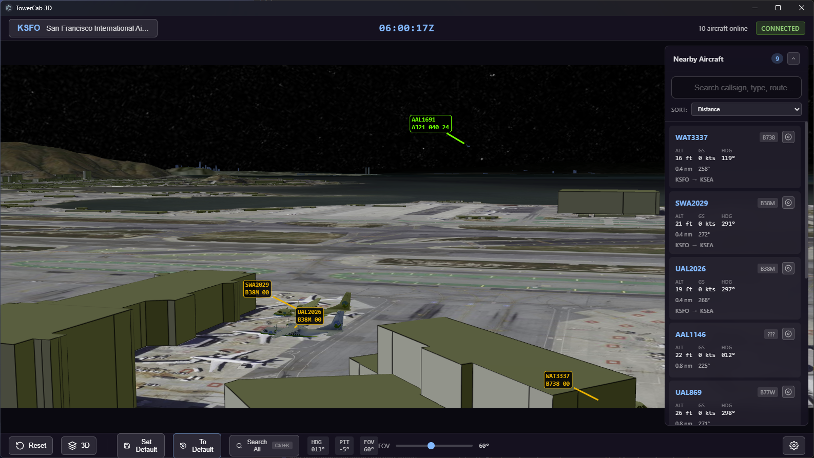

# TowerCab 3D

A 3D tower cab view application for VATSIM air traffic controllers. View real-time aircraft positions on a 3D globe with satellite imagery and terrain.



## Table of Contents

- [Features](#features)
- [Requirements](#requirements)
- [Quick Start](#quick-start)
- [Controls](#controls)
- [Building for Production](#building-for-production)
- [Project Structure](#project-structure)
- [Technology Stack](#technology-stack)
- [Data Sources](#data-sources)
- [Settings Reference](#settings-reference)
- [Performance Tips](#performance-tips)
- [Troubleshooting](#troubleshooting)
- [CI/CD](#cicd)
- [License](#license)
- [Acknowledgments](#acknowledgments)

## Features

### Live VATSIM Integration
- Real-time aircraft positions from VATSIM network (polled every 3 seconds, VATSIM updates ~15 seconds)
- Smooth 60 Hz interpolation for fluid aircraft movement
- Global aircraft search (Ctrl+K) to find and follow any aircraft on the network
- Connection status indicator with pilot count
- Compass direction indicator showing camera heading

### 3D Visualization
- High-fidelity 3D globe with Cesium Ion satellite imagery
- Configurable terrain quality (5 levels from Low to Ultra)
- Optional 3D OpenStreetMap buildings
- Dynamic time-of-day lighting (real-time or fixed hour)
- Aircraft rendered as 3D models with realistic type-based sizing (39 aircraft types)
- Aircraft physics emulation: pitch during climbs/descents, banking in turns, landing flare
- METAR-based weather effects: fog domes and cloud layers at real ceiling altitudes

### Multi-Viewport System
- Create multiple inset viewports for simultaneous views
- Each viewport has independent camera controls and can follow different aircraft
- Drag and resize inset viewports, positions saved per airport
- Click to activate a viewport for keyboard/mouse control

### Replay System
- Continuous recording of all VATSIM traffic (snapshots every 15 seconds)
- Scrub back up to 25 minutes to review past events
- Playback at 0.5x, 1x, 2x, or 4x speed
- Export/import replays to share or archive sessions
- Switch airports during replay to view traffic at any location

### Camera System
- **3D Tower View**: Look around from tower perspective with smooth controls
- **Top-Down View**: Bird's-eye view with pan and zoom (press T to toggle)
- **Aircraft Following**: Two modes - Tower (camera stays at tower) or Orbit (camera circles aircraft)
- **WASD Movement**: Move camera position relative to tower
- **Bookmark System**: Save up to 100 camera positions per airport with custom names
- **Quick Bookmarks**: Ctrl+0-9 for instant recall of first 10 bookmarks
- **Bookmark Manager**: Ctrl+B opens full bookmark management modal

### Aircraft Panel
- Nearby aircraft list with real-time updates
- Filter by callsign, aircraft type, or route
- Sort by distance (from tower or camera), callsign, altitude, speed, or smart sort
- Smart sort categorizes by flight phase (Short Final, Rolling, Taxi, etc.) with runway detection
- Datablock repositioning with numpad-style directions (1-9)
- Auto-rearrange to prevent label overlaps (optional)
- Adjustable leader line length (1-5)
- One-click following with mode selection
- Click-to-look: click any aircraft to pan camera to center on it

### Airport Selection
- Search 28,000+ airports by ICAO, IATA, name, or city
- Recent airports history
- Quick access to popular international hubs
- Smooth camera animation when changing airports

### Measuring Tool
- Click-to-measure distances on terrain
- Live preview as you move the cursor
- Multiple measurements can be active simultaneously
- Right-click to remove individual measurements

### VR Support (Experimental)
- WebXR integration for VR headsets (Quest Link, SteamVR, etc.)
- Stereo rendering with configurable IPD
- Immersive tower cab experience

### Modding Support
- Custom aircraft 3D models (glTF/GLB format)
- Custom tower models for specific airports
- FSLTL (FS Live Traffic Liveries) model import with airline-specific liveries
- See [MODDING.md](MODDING.md) for details

## Requirements

- Windows 10/11 (64-bit), macOS 10.13+, or Linux
- Cesium Ion account (free tier) for terrain and imagery
- Node.js 18+ and Rust toolchain (only for development)

## Quick Start

### Option A: Download the Installer (Recommended)

1. Download the latest Windows installer from [GitHub Releases](https://github.com/leftos/towercab-3d/releases)
2. Run the installer and follow the prompts
3. Launch TowerCab 3D from the Start Menu or desktop shortcut
4. The app will automatically check for updates on startup and notify you when new versions are available
5. Continue to [Get a Cesium Ion Token](#2-get-a-cesium-ion-token) below

### Option B: Run from Source (Development)

#### 1. Install Dependencies

```bash
npm install
```

#### 2. Run in Development Mode

```bash
npm run dev
```

### 2. Get a Cesium Ion Token

1. Create a free account at [cesium.com/ion](https://cesium.com/ion)
2. Go to Access Tokens and create a new token with default permissions
3. Copy the token

### 3. Configure the Application

1. Click the **Settings** button (gear icon) in the bottom-right corner
2. Paste your Cesium Ion token in the token field
3. Adjust terrain quality and other settings as desired
4. Close the settings modal

### 4. Select an Airport

1. Click the airport button in the top-left (shows "Select Airport" initially)
2. Search for an airport by ICAO code (e.g., "KJFK"), IATA code (e.g., "JFK"), name, or city
3. Click an airport to fly there

## Controls

### Keyboard Controls

| Key | Action |
|-----|--------|
| **W/A/S/D** | Move camera position (forward/left/back/right) |
| **Q/E** | Move camera down/up |
| **Shift** | Sprint (3x movement speed with WASD) |
| **Arrow Keys** | Rotate camera (heading/pitch) |
| **+/-** | Zoom in/out |
| **T** | Toggle 3D / top-down view |
| **R** or **Home** | Reset camera view |
| **Shift+R** | Full reset (position and orientation) |
| **O** | Toggle follow mode (Tower/Orbit) when following |
| **Escape** | Stop following / close modals |
| **Ctrl+K** | Open global aircraft search |
| **Ctrl+B** | Open bookmark manager |
| **Ctrl+0-9** | Load bookmarks 0-9 instantly |
| **Ctrl+M** | Toggle METAR overlay display |
| **M** | Toggle measuring tool |
| **F1** | Toggle performance HUD |
| **F3** | Open model matching debug modal |
| **Space** | Play/Pause replay (in Replay mode) |
| **Left/Right Arrow** | Step backward/forward 15s (in Replay mode) |

### Mouse Controls

| Action | Effect |
|--------|--------|
| **Right-click + Drag** | Look around (rotate camera) |
| **Left-click + Drag** | Pan camera (top-down mode only) |
| **Scroll Wheel** | Zoom in/out |
| **Click Aircraft Label** | Follow that aircraft |

### Bookmark System

Save and restore camera positions quickly:
- Type `.XX.` to **save** to slot XX (e.g., `.00.`, `.15.`)
- Type `.XX.NAME.` to **save** with a custom name (e.g., `.00.RWY 27.`, `.15.TOWER.`)
- Type `.XX` and press Enter to **load** from a slot
- Press **Ctrl+0-9** for instant recall of bookmarks 0-9
- Press **Ctrl+B** to open the Bookmark Manager with full keyboard navigation
- Bookmarks are saved per-airport

## Building for Production

### Development Build (Frontend Only)
```bash
npm run vite:build
```

### Full Application Build (Windows Installer)
```bash
npm run build
```

The installer will be created in the `src-tauri/target/release/bundle/` folder. This is the same installer distributed via [GitHub Releases](https://github.com/leftos/towercab-3d/releases).

## Project Structure

```
towercab-3d/
├── src/
│   └── renderer/       # React frontend
│       ├── components/ # React UI components
│       ├── hooks/      # Custom React hooks
│       ├── services/   # API services (VATSIM, airports)
│       ├── stores/     # Zustand state stores
│       ├── types/      # TypeScript type definitions
│       └── utils/      # Utility functions
├── src-tauri/          # Tauri Rust backend
│   ├── src/            # Rust source code
│   ├── icons/          # Application icons
│   └── tauri.conf.json # Tauri configuration
├── resources/          # Static assets (icons, etc.)
└── mods/               # Custom models directory
    ├── aircraft/       # Aircraft model mods
    └── towers/         # Tower model mods
```

## Technology Stack

| Technology | Purpose |
|------------|---------|
| **Tauri 2** | Desktop application framework (Rust backend, WebView2 frontend) |
| **React 19** | UI framework |
| **TypeScript 5** | Type-safe development |
| **CesiumJS 1.136** | 3D globe rendering |
| **Babylon.js 8** | Screen-space labels, leader lines, weather effects, VR rendering |
| **Zustand 5** | State management |
| **Vite 7** | Build tool |

## Data Sources

- **VATSIM**: Real-time flight data from [data.vatsim.net](https://data.vatsim.net/v3/vatsim-data.json)
- **Airports**: Database from [github.com/mwgg/Airports](https://github.com/mwgg/Airports)
- **Terrain/Imagery**: Cesium Ion World Terrain and Bing Maps Aerial
- **Aircraft Dimensions**: Wingspan and length data from [FAA Aircraft Characteristics Database](https://www.faa.gov/airports/engineering/aircraft_char_database)
- **Aircraft 3D Models**: 39 aircraft models from [Flightradar24/fr24-3d-models](https://github.com/Flightradar24/fr24-3d-models) (GPL-2.0, originally from FlightGear) - includes A320 family, B737/747/757/767/777/787, CRJ, E-Jets, Q400, and more

### Refreshing Aircraft Dimensions Data

The aircraft dimensions data (used for realistic model sizing) is bundled with the app. To update it with the latest FAA data:

```bash
# Requires Python 3 with pandas and openpyxl
pip install pandas openpyxl
python scripts/convert-aircraft-data.py
```

This downloads the latest FAA Excel file and converts it to `src/renderer/public/aircraft-dimensions.json`.

## Settings Reference

Settings are organized into tabs: General, Display, Graphics, Performance, and Help.

### General Tab
| Setting | Description | Range |
|---------|-------------|-------|
| Cesium Ion Token | API key for terrain/imagery | Required |
| Theme | Light or dark interface | Light/Dark |
| Default FOV | Starting field of view | 10-120° |
| Camera Speed | WASD movement speed | 0.1x-3x |
| Mouse Sensitivity | Right-click drag rotation speed | 0.1x-3x |

### Display Tab
| Setting | Description | Options |
|---------|-------------|---------|
| Label Visibility Distance | How far to show aircraft labels | 5-100 nm |
| Datablock Display | Label detail level | Full/Airline Codes Only/None |
| Show Aircraft Panel | Toggle nearby aircraft list | On/Off |
| Show Ground Traffic | Display aircraft on ground | On/Off |
| Show Airborne Traffic | Display flying aircraft | On/Off |
| Max Aircraft | Limit displayed aircraft count | 10-500 |

### Graphics Tab
| Setting | Description | Options |
|---------|-------------|---------|
| Terrain Quality | Level of terrain detail | Low to Ultra (5 levels) |
| Show 3D Buildings | OpenStreetMap 3D buildings | On/Off |
| Time of Day | Real-time or fixed local hour | Real/0-24h |
| Enable Fog | METAR-based fog effects | On/Off |
| Fog Intensity | Fog opacity multiplier | 0.5x-2x |
| Visibility Scale | Fog distance multiplier | 0.5x-2x |
| Enable Clouds | Cloud layers at METAR ceilings | On/Off |
| Ambient Occlusion | HBAO screen-space shading | On/Off |

### Display Tab (continued)
| Setting | Description | Options |
|---------|-------------|---------|
| Orientation Emulation | Aircraft pitch/roll physics simulation | On/Off |
| Emulation Intensity | Strength of pitch/roll effects | 25%-150% |

### Performance Tab
| Setting | Description | Range |
|---------|-------------|-------|
| In-Memory Tile Cache | Cached terrain tiles in memory | 50-500 tiles |
| Disk Cache Size | Persistent tile cache on disk | 0.1-10 GB |
| Aircraft Data Radius | VATSIM data fetch radius | 50-500 nm |

## Performance Tips

- Lower terrain quality for smoother performance on older hardware
- Disable 3D buildings if experiencing frame drops
- Reduce label visibility distance to decrease rendered aircraft
- The application uses Service Worker caching for tile persistence

## Troubleshooting

### Globe Not Loading
- Verify your Cesium Ion token is correct and has default permissions
- Check your internet connection

### No Aircraft Showing
- Ensure you've selected an airport
- Check the connection status in the top bar
- Verify VATSIM network is online

### Low Frame Rate
- Reduce terrain quality in settings
- Disable 3D buildings
- Close other GPU-intensive applications

## CI/CD

This project uses GitHub Actions for continuous integration and releases:

- **Build workflow**: Runs on every push and PR to `main` - builds the app and runs ESLint
- **Release workflow**: Triggered by version tags (e.g., `v0.0.6`) - creates GitHub releases with installers

To create a new release:
```bash
git tag v0.0.6
git push origin v0.0.6
```

## License

GPL-2.0 License - See [LICENSE](LICENSE) file for details.

## Acknowledgments

- [VATSIM](https://vatsim.net) - Virtual Air Traffic Simulation Network
- [Cesium](https://cesium.com) - 3D geospatial platform
- [mwgg/Airports](https://github.com/mwgg/Airports) - Airport database
- [Babylon.js](https://babylonjs.com) - 3D rendering engine
- [FlightGear](https://www.flightgear.org/) / [FGMEMBERS](https://github.com/FGMEMBERS) - Aircraft 3D model (via [Flightradar24](https://github.com/Flightradar24/fr24-3d-models))
